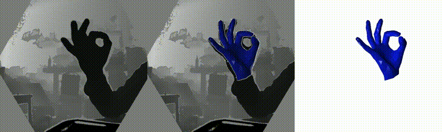

## GeeFish Technology Co. Ltd.

# enjoyAI_handpose

* [Chinese](../README.md)
* [English](/doc/English.md)

# Introduction

### A company dedicated to creating a more natural and convenient human-computer interaction experience.
### Our self-developed gesture recognition algorithm solution has the following advantages:

1) Camera Support:
* Time of Flight (ToF) camera.
* Color camera.
* Grayscale camera.
2) Support for both minor and major distortion cameras, such as fisheye cameras.

3) Support for third-person and first-person gesture interaction.

4) Support for multiple predefined gestures.

5) Customization services for designated cameras and core algorithm solutions.

## 1.HandPose

### third-person gesture interaction

### first-person gesture interaction

## Contact information

* enjoyai@geefish.com
